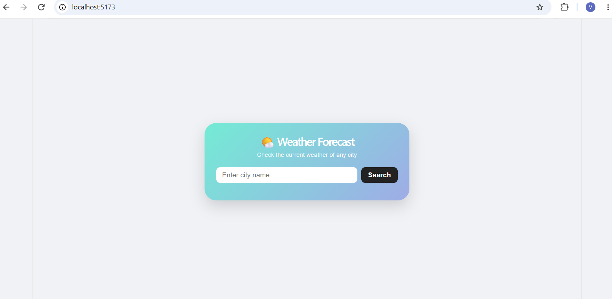
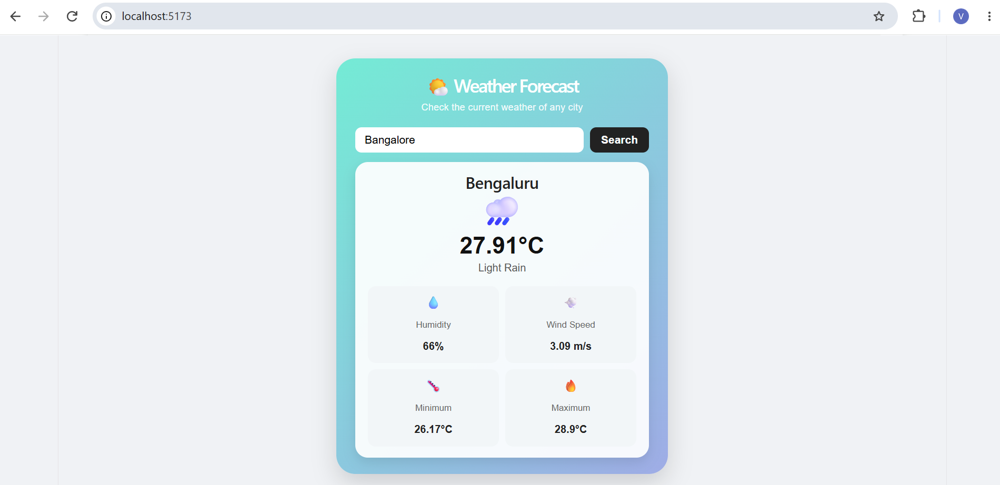

# Weather Forecast

A simple weather forecast application built using **FastAPI, React.js, and OpenWeather API**.

### Features

* Search weather by city
* Temperature
* Weather condition
* Humidity
* Wind speed
* Error handling

### Technologies

* Python
* FastAPI
* React.js
* JavaScript
* OpenWeather API
  
## Project Output

### Home Page

### Weather Result

### Author

**Vanitha M S**
